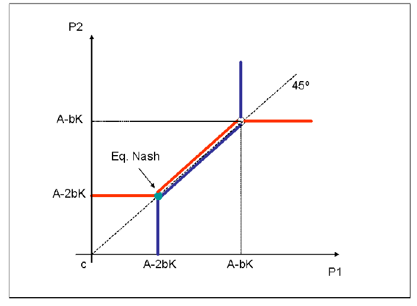

# Interdependencia Estrategica

## Cartel

Nesta seção, vamos falar de uma situação em que (1) existem poucas empresas e (2) elas reconhecem esta interdependência e trabalham de forma coordenada para maximizar seus lucros conjuntos.

O grande dilema é como fazer isso funcionar, por duas razões:

* Isso costuma ser ilegal -- ou seja, se as empresas e as pessoas forem pegas fazendo isso, elas vão em cana.
* O ``Dilema dos Prisioneiros'' -- há todo o incentivo para que as empresas tentem convencer as outras a participar de um cartel e, ao mesmo tempo, renegar o acordo na forma de descontos secretos.

Antes de falarmos o que precisa ser necessário para se implementar um cartel, vamos falar o que *NÃO* precisa para se conseguir ser um cartel (algumas delas até facilitam, mas não são indispensáveis):

* Poucas empresas: Um dos setores com maior número de condenações no CADE por cartel é o de Postos de Gasolina
* Empresas grandes em relação ao mercado: existe caso até de cartel de padarias no CADE

O que é necessário para um cartel funcionar:

* Coordenar em preços (ou divisão de clientes)
* Coordenar a alocação de produção entre os membros do cartel
* Observabilidade das ações dos agentes: as empresas que participam do cartel precisam ser capazes de observar as ações (preços, quantidades vendidas)
* Capacidade de punição de desvios em relação ao combinado: as empresas que participam do cartel precisam ser capazes de inflingir algum tipo de punição àquelas que não cumprem o que foi prometido.

E note-se que estas duas características não são imutavelmente gravadas em pedra - muitos carteis que buscavam sucesso continuado conseguiram estender a vida útil dele por meio de mudanças no comportamento das próprias empresas que permitiam a melhora das duas dimensões -- tornar as ações mais observáveis e permitir punições automáticas.

Outro mecanismo que é muito comum e muito empregado para aumentar a ``vida útil'' dos carteis é o emprego de empresas/associações patronais para permitir que um terceiro realize as atividades de observação dos seus companheiros de cartel. Afinal de contas, não se pode confiar nos seus colegas de crime (pois cartel é crime em muitas jurisdições) para garantir que as ações sejam observadas de forma imparcial, né?

Um exemplo de empresa que (em sua encarnação anterior, AC Treuhand) realizou muitos dos trabalhos necessários para a manutenção de carteis é a ARCO [link](https://arco.swiss/en). 

**Disclaimer**: Não estou afirmando que esta empresa se envolve em atividades acessórias a crimes de cartel; todavia, nas mãos de um grupo de empresas mal intencionadas, cada um dos serviços ali apresentados pode ser utilizado para aumentar a observabilidade das ações dos comparsas em um cartel.

### História -- o cartel dos geradores de eletricidade

Este é um texto baseado em parte em um box que está no livro do Carlton e Perloff, sobre o mercado de geradores de eletricidade nos Estados Unidos, ao longo das décadas de 50, 60 e 70.

Nos anos 50, existiam três empresas no mercado de turbinas geradoras de energia:
* Westinghouse
* General Electric
* Allis-Chalmers

As empresas produziam geradores de eletricidade para as companhias geradoras de energia. Essencialmente as companhias preparavam uma planta geradora -- tipo uma hidroelétrica -- e depois especificavam em detalhe a quantidade e as características dos geradores que iam na barragem. As empresas que vendiam os geradores submetiam suas propostas e as companhias geradoras fechavam com aquela que oferece o menor preço. 

Aí no ano de 1959, em uma competição por ofertas para a TVA -- Tennessee Valley Authority, um jornalista notou que a oferta vencedora foi de 96,760 dólares (da Westinghouse) e as ofertas das três outras empresas que perderam foram de 112,712 dólares -- exatamente as mesmas. Evidentemente, isso é muito esquisito -- as empresas são completamente diferentes e produzem seus geradores em lugares e condições completamente diferentes.

Posteriormente, descobriu-se que as empresas já tinham se reunido no Hotel Traymore, em Atlantic City, para dividir o mercado de acordo com a seguinte fórmula:

* 42\% para a GE
* 38\% para a Westinghouse
* Allis-Chalmers com 11\%
* I-T-E 9\%

Eventualmente fizeram alguns ajustes para acomodar alguns entrantes. Mas estes encontros se tornaram regulares e conseguiram manter estas participações por vários anos. O mecanismo do contrato era o mais curioso. Uma empresa -- a selecionada pelo cartel -- ia colocar o menor preço, e uma era escalada pra cobrar um preço intermediário, e uma terceira pra cobrar o preço alto. A que cobrou um preço mais alto iria, em outra ocasião, cobrar o preço mais baixo, e assim sucessivamente em uma rotação. O mecanismo pelo qual a empresa era selecionada para dar o lance mais baixo -- e ganhar -- era bastante curioso: as fases da lua. A depender de qual fase a lua se encontrasse na época do certame, uma das empresas era escolhida.

Esta investigação levou a uma condenação depois de dois anos. As empresas foram condenadas a aproximadamente 2 milhões de dólares, as sete pessoas mais importantes foram presas e as outras multadas. Além disso, as empresas prejudicadas pelo cartel entraram com ações de reparação de danos que, ao fim e ao cabo, colocaram o custo disso para as empresas acima de 400 milhões de dólares (dos anos 60!).

Depois dessa condenação, as empresas menores (Allis-Chalmers, I-T-E) saíram do mercado, deixando só a GE e a Westinghouse em uma situação bem complicada -- margens pequenas e tendo que lidar com a ressaca da condenação e os custos associados. 

No começo dos anos 60, uma nova forma de coordenação foi proposta pela GE,
sem nenhum acordo formal -- nem fases da lua. A GE anunciou a seguinte política:

* Uma nova tabela de preços que simplificava o cálculo dos preços dos produtos para a elaboração dos lances;
* Os preços de tabela seriam reduzidos significativamente,
mas;
  - Os preços verdadeiros seriam o valor do preço de tabela multiplicado
por um fator comum, ajustado de forma que mantinha os preços aproximadamente
iguais aos vigentes;
  - A GE anunciou que venderia a estes preços a todos os consumidores *sem exceção*.
  - Uma cláusula de proteção de preços foi instituída, em que, na eventualidade de uma redução de preços, a GE reduziria os preços retroativamente para qualquer consumidor que comprou um gerador nos últimos seis meses;
* Uma empresa de consultoria iria auditar a **compliance** da GE com este acordo;
* Os lances colocados pela GE, bem como os pedidos efetivamente feitos, foram tornados públicos

Com isso, eles conseguiram elevar suas margens novamente, até serem acusados de cartel novamente nos anos 70. 


### Teoria: Jogos Repetidos

Para que possamos entender teoricamente porque arranjos como o da subseção anterior funcionam, precisamos nos dar conta que a interação estratégica entre as empresas é repetida. Ou seja, ainda que a decisão de preços ou quantidades produzidas tem que ser tomada em cada instante do tempo, o fato é que a empresa vai conviver de forma indefinida com esses oponentes. Neste sentido, o *payoff*  da ação é um valor presente líquido, descontado de acordo com uma taxa que reflita o risco e a expectativa de duração da interação. 
Neste sentido, vamos supor que a ação envolve duas coisas -- sair do conluio ou se manter nele. Caso a empresa decida se manter no cartel, o valor presente dos lucros seria então:


\[
VP=\frac{\pi_{c}}{1+r}+\frac{\pi_{c}}{(1+r)^{2}}+\cdots=\frac{\pi_{c}}{r}
\]

Caso a empresa desvie da solução de conluio, duas coisas provavelmente acontecerão. Em primeiro lugar, ela conseguirá lucros maiores por um tempo -- pois os seus oponentes não se dão conta que ela não está mais no acordo. No entanto, quando elas o fazem, elas podem *punir* a empresa desviante. Ou seja, caso ela desvie da solução de conluio, e consiga lucros adicionais no curto prazo, seguidos de lucros menores depois, temos:

\[
VPC=\frac{\pi_{m}}{1+r}+\frac{\pi_{n}}{(1+r)^{2}}+\cdots
\]

Podemos notar que a empresa se mantém interessada no cartel caso $VP>VPC$.
Isso pode acontecer quando:

$$
\begin{align*}
\pi_{n} & < \pi_{c}\\
\pi_{m} & > \pi_{c}
\end{align*}
$$

E quando $r$ baixo o suficiente.
Existe um resultado em jogos repetidos, chamado *Teorema Popular*,
que afirma que qualquer estratégia -- e, conseqüentemente,
os $\pi$ associados -- pode ser sustentável como um equilíbrio
de Nash em jogos repetidos, desde que a taxa de desconto seja baixa
o suficiente. Se chama *Teorema Popular* porque, durante muito tempo, a comunidade dos economistas acreditava e discutia o resultado, mas não havia uma
prova formal do mesmo. Rubinstein (1979) propôs uma prova formal do resultado.

Intuitivamente, isso significa que carteis são mais estaveis quando:

* É mais fácil descobrir os desvios -- a fase de lucros maiores da empresa que desvia dura menos no tempo
* A punição é mais forte -- ou seja, a perda de lucros é maior na eventualidade de descoberta
* O fator de desconto é mais baixo -- ou seja, o futuro é mais valioso.


## Oligopólio

Iremos trabalhar um dos principais modelos para entender competição imperfeita, o Modelo de Cournot. Inicialmente iremos fazer uma demonstração mais geral, para depois especializarmos para uma demanda linear.

### Resultado geral

Vamos assumir que existam $n$ empresas neste mercado, cada uma indexada por $i$. A decisão delas é sobre o quanto produzir, representada por $q_{i}$. O custo marginal de produção é constante e não necessariamente idêntico entre as empresas. 
O preço de mercado é igual para todas as empresas e é o resultado da quantidade **total** produzida, $P=f(\sum_{i=1}^{n} q_{i})=f(Q)$, de acordo com o que se espera de uma função demanda, $f^{\prime}<0$. Com essa definição, temos a seguinte expressão para a função receita marginal:
  
  $$
  \begin{aligned}
RT_{i}&=P\times q_{i}\\
RMg_{i}&=\frac{\partial RT_{i}}{\partial q_{i}}=P+q_{i}\times \frac{\partial P}{\partial Q}\times \sum_{j=1}^{n}\frac{\partial q_{j}}{\partial q_{i}}
\end{aligned}
$$
  
  A expressão para a receita marginal neste caso pode ser expressa informalmente da seguinte forma. O efeito de um aumento marginal na quantidade produzida é o preço destas unidades marginais produzidas menos o efeito desta quantidade marginal produzida sobre os preços de mercado. A diferença desta expressão em relação à de monopólio é que o efeito final sobre a quantidade total depende do aumento da própria empresa $i$ e de o que a empresa $i$ considera que seus oponentes $j\neq i$ farão em resposta à ação de $i$ -- daí esses componentes da somatória serem também conhecidos como ``variações conjecturais''.

Estas variações conjecturais são conhecidas desde os anos 60 do século passado; todavia, apenas com a formalização em teoria dos jogos que se conseguiu mapear de forma mais organizada o que se entende ou se espera destas variações conjecturais. Basicamente, aqui iremos utilizar o conceito de equilíbrio de Nash para a determinação do equilíbrio -- o que faz com que esta função receita marginal seja base para a construção das Funções Melhor Resposta. 

Basicamente, a melhor resposta para uma firma $i$ vai ser a escolha de quantidades para esta empresa que maximiza seus lucros assumindo que as quantidades dos seus oponentes sejam constantes. 

Com esta premissa, temos:
  
  $$
  \begin{aligned}
\frac{\partial q_{j}}{\partial q_{i}}&=0,j\neq i\\
\frac{\partial q_{j}}{\partial q_{i}}&=1,j= i\\
\end{aligned}
$$
  
  Com isso, a função melhor resposta fica sendo:
  
  $$
  \begin{aligned}
RMg_{i}-CMg_{i}&=0\\
P-CMg_{i}+q_{i}\times \frac{\partial P}{\partial Q}&=0\\
\frac{P-CMg_{i}}{P}&=\frac{q_{i}}{Q}\times \frac{1}{|\varepsilon_{D}|}=\frac{s_{i}}{|\varepsilon_{D}|}
\end{aligned}
$$
  
  Supondo que esta condição valha para cada uma das empresas, temos que as margens preço-lucro aqui são iguais à razão entre a participação de mercado e o valor absoluto da elasticidade-preço da demanda. Intuitivamente, empresas mais eficientes (com menores custos marginais) tem maiores margens preço-custo marginal e maiores participações de mercado.

Outro resultado interessante acontece quando tentamos calcular a margem preço-custo média da indústria:
  
  $$
  \begin{aligned}
\sum_{i=1}^{n}s_{i} \times \frac{P-CMg_{i}}{P}&=\sum_{i=1}^{n}\frac{s_{i}^{2}}{|\varepsilon_{D}|}\\
\frac{P-\overline{CMg_{i}}}{P}&=\frac{HHI}{|\varepsilon_{D}|}
\end{aligned}
$$
  Em que $HHI$ é o chamado Índice Herfindahl-Hirschman. Se as premissas do modelo de Cournot forem válidas (competição por quantidades, produtos homogêneos), uma forma de avaliar a competitividade em um mercado sem ter que descobrir quais seriam os custos marginais é simplesmente calcular o Índice Herfindahl-Hirschman.

### Exemplo: Demanda Linear

Vamos agora assumir uma demanda e custos marginais lineares, e duas empresas. A vantagem dessa abordagem é que ela permite que apresentamos as coisas de forma gráfica. Como anteriormente, vamos assumir que a demanda inversa é uma função das quantidades produzidas das duas empresas

$$
  P=a-b(q_{1}+q_{2})
$$
  Como disse anteriormente, os custos marginais são constantes, o que significa que $CT_{i}=c_{i}\times q_{i}, i=1,2$.

As funções lucro das empresas 1 e 2 são da seguinte forma então:
  
  $$
  \begin{aligned}
\pi_{i}&=(P-c_{i})q_{i}=(a-b(q_{1}+q_{2})-c_{i})q_{i}\\
\pi_{1}&=(P-c_{1})q_{1}=(a-b(q_{1}+q_{2})-c_{1})q_{1}\\
\pi_{2}&=(P-c_{2})q_{2}=(a-b(q_{1}+q_{2})-c_{2})q_{2}
\end{aligned}
$$
  
  Podemos construir duas coisas a partir das funções lucro $\pi_{i}$: as funções isolucro e as funções melhor resposta. A primeira delas é o lugar geométrico dos pontos correspondentes a um determinado nível de lucro, e a segunda diz, para uma determinada quantidade de uma das empresas, quanto o seu oponente deveria produzir para maximizar seus lucros.

Esta última podemos derivar a partir das condições de primeira ordem:
  
  $$
  \frac{\partial \pi_{1}}{\partial q_{1}}=(a-2bq_{1}-bq_{2}-c_{1})=0
$$
  
  Reorganizando, chegamos às seguintes funções melhor resposta:
  
  $$
  \begin{aligned}
q_{1}&=\frac{a-bq_{2}-c_{1}}{2b}\\
q_{2}&=\frac{a-bq_{1}-c_{2}}{2b}
\end{aligned}
$$
  
  O equilíbrio de Nash deste jogo acontece quando temos as duas funções melhor resposta valendo simultaneamente. Ou seja, quando resolvemos o sistema de duas equações em duas incógnitas. Supondo custos marginais constantes, temos as seguintes quantidades e preço de equilíbrio:
  
  $$
  \begin{aligned}
q_{1}=q_{2}&=\frac{a-c}{3b}\\
Q&=2\frac{a-c}{3b}\\
P&=\frac{a+2c}{3}
\end{aligned}
$$
  
  Podemos ver graficamente esta solução a partir da figura a seguir:
  
  <iframe scrolling='no' frameborder='0' src='https://www.wolframcloud.com/objects/demonstrations/CournotCompetitionWithTwoFirms?_view=EMBED' style='border:0;' width= '600' height='650'></iframe>
  
  Primeira coisa interessante deste modelo de Cournot é que ele consegue representar um ``caminho intermediário'' entre o monopólio e competição perfeita. Por exemplo, em um mercado monopolizado, teríamos o seguinte:
  
  $$
  \begin{aligned}
Q&=\frac{a-c}{2b}\\
P&=\frac{a+c}{2}
\end{aligned}
$$
  
  Esta seria a quantidade de equilíbrio que um cartel que buscasse maximizar os lucros também produziria. Supondo firmas idênticas, teríamos $q_{i}=\frac{a-c}{4b}$. O problema é que esta configuração não é um equilíbrio estável. Se as duas empresas estiverem produzindo isso, a melhor resposta de uma delas é aumentar um pouco sua produção.

O segundo ponto interessante é que o modelo de Cournot mantém essa característica de ``caso intermediário'' à medida em que variamos o número de empresas.

### Modelo de Cournot com muitas firmas

Usando a mesma forma de demanda e custos, apenas assumindo que as firmas são idênticas e que ao invés de duas, existem $n$ empresas. A função demanda fica sendo então:
  
  $$
  P=a-b(\sum_{j=1}^{n}q_{j})
$$
  
  A função lucro de uma firma específica fica então sendo:
  
  $$
  \pi_{i}=(a-b(\sum_{j=1}^{n}q_{j})-c)q_{i}
$$
  
  Vamos ter as seguintes Condições de Primeira Ordem:
  
  $$
  \frac{\pi_{i}}{q_{i}}=a-b(\sum_{j=1}^{n}q_{j})-bq_{i}-c=0
$$
  
  Reorganizando, chegamos à seguinte função melhor resposta para a empresa genérica $i$:
  
  $$
  q_{i}=\frac{a-b\sum_{j=1}^{n}q_{j}-c}{b}
$$
  
  Se as empresas são iguais, espera-se que elas em equilíbrio produzam a mesma coisa, ou seja, $q_{i}=q_{j}=q^{*}$
  
  $$
  \begin{aligned}
q^{*}&=\frac{a-bnq^{*}-c}{b}\\
q^{*}&=\frac{1}{n+1}\frac{a-c}{b}\\
Q=nq^{*}&=\frac{n}{n+1}\frac{a-c}{b}\\
P=&\frac{a}{n+1}+c\frac{n}{n+1}
\end{aligned}
$$
  
  Com $n\rightarrow \infty$, temos que a solução se aproxima de competição perfeita. 
  
  ## Introdução

```{r input02, echo=FALSE, eval=TRUE}
library("shiny")
```

Neste texto, iremos analisar o modelo inicialmente desenvolvido por Joseph Bertrand como uma resposta às conclusões do Modelo de Cournot. Dentro deste modelo, a principal variável estratégica utilizada são os preços cobrados pelas empresas envolvidas

### Exposição Inicial

Vamos supor a existência de duas firmas e que não exista diferenciação de produto. Ou seja, os produtos são substituíveis aos olhos do consumidor e, tendo em vista que eles conhecem os preços dos dois produtores, eles irão comprar do produtor de menor preço.
Caso as duas empresas cobrem o mesmo preço, elas dividirão o mercado igualmente. Considerando uma função demanda de mercado dada por $Q=D(P)$, e supondo que cada firma tenha um custo marginal constante e igual a $c$, temos que a função lucro para a firma $i=1,2$ igual a:

$$
\pi_{i}(p_{i},p_{j})=(p_{i}-c)\times D_{i}(p_{i},p_{j})
$$

Coloquei o subscrito $i$ na função demanda porque é a quantidade de cada empresa. Mais especificamente, temos:

$$
D_{i}=\begin{cases} D(p_{i}), \quad p_{i}<p_{j}\\ \frac{D(p_{i})}{2}, \quad p_{i}=p_{j}\\
0,\quad p_{i}>p_{j} \end{cases}
$$
Além disso, podemos afirmar que o lucro agregado de mercado, $\pi_{1}+\pi_{2}$ é menor do que o lucro que aconteceria se o mercado fosse monopolizado. Além disso, não há situação em que a empresa cobre um preço maior do que o custo marginal e ganhe lucros negativos. Estas duas premissas são necessárias somente para que a gente garanta que não exista uma configuração esquisita de mercado em que exista apenas uma empresa.

#### O "Paradoxo de Bertrand"

Vamos mostrar agora um teorema, que deu margem ao chamado "Paradoxo de Bertrand". Para esta demonstração, vamos usar novamente os conceitos de Teoria dos Jogos e caracterizar este equilíbrio como também um Equilíbrio de Nash.

Um equilíbrio de Nash é um conjunto de configurações de estratégias (no nosso caso, preços) tal que cada uma delas é uma melhor resposta às estratégias dos seus oponentes.

Com isso, podemos afirmar o seguinte teorema:

**O Jogo acima exposto somente admite um Equilíbrio de Nash em estratégias puras,em que cada empresa cobra um preço exatamente igual ao custo marginal, isto é, $p_{1}^{*}=p_{2}^{*}=c$**

A demonstração é a seguinte:

Vamos começar imaginando que isso não seja verdade, e que exista um equilíbrio de Nash em que esta condição não se verifique. Mostraremos que cada uma das possibilidades leva a uma contradição. 
Caso 01: Suponha que $p_{1}>p_{2}>c$. Neste caso, a firma 1 não vende nada e o seu lucro é zero. Por outro lado, se a firma 1 abaixar o seu preço para $p_{1}=p_{2}^{*}-\varepsilon$, com $\varepsilon$ positivo e pequeno, ela teria a demanda completa do mercado a este preço, $D(p_{2}^{*}-\varepsilon)$ e obteria uma margem positiva igual a $p_{2}^{*}-\varepsilon-c$. Portanto, a firma 1 não poderia estar maximizando seus lucros para o preço de 2 igual a $p_{2}^{*}$, ou seja isso não pode ser uma parte do equilíbrio de Nash.
Vamos agora supor que $p_{1}^{*}=p_{2}^{*}>c$. Neste caso, o lucro da firma 1 seria $\frac{D(p_{1}^{*})(p_{1}^{*}-c)}{2}$. Se a firma 1 cobrasse um preço igual a $p_{1}=p_{2}^{*}-\varepsilon$, o seu lucro seria então $D(p_{2}^{*}-\varepsilon)(p_{1}-c)$, que é maior -- se continuarmos a considerar um $\varepsilon$ pequeno.

Neste caso, a participação de mercado da firma aumentaria de uma forma descontínua. Uma vez que nenhuma firma iria cobrar um preço inferior ao custo marginal $c$, a única solução possível é que pelo menos uma das firmas cobre exatamente este custo. 

Finalmente, caso tivéssemos $p_{1}^{*}>p_{2}^{*}=c$, a firma 2 poderia aumentar os seus preços para um $\varepsilon$ pra baixo de $p_{1}$, continuar atendendo todo o mercado e aumentar os seus lucros. Portanto, esta configuração também não é um equilíbrio. Portanto, o teorema está provado.


Este resultado é chamado "Paradoxo de Betrand" porque leva a uma conclusão, bem, paradoxal: um duopólio, sem competidores adicionais, levando a resultados idênticos à de competição perfeita. 

Como todo resultado aparentemente paradoxal, a importância dele reside em ressaltar quais são as condições necessárias para que ele valha, permitindo que a gente relaxe estas premissas uma por vez e chegue em vários resultados interessantes.

As premissas relevantes são:

* Produtos Homogêneos
* Cada empresa é capaz de atender sozinha o mercado se for a empresa com o preço mais barato
* Estamos nos atendo a equilíbrios em estratégias puras
* Todos os (dois) preços são conhecidos por todos os consumidores

Ao longo das próximas aulas, iremos falar de extensões deste modelos em todas as direções.


### Bertrand com Produtos Diferenciados

Vamos assumir que os produtos sejam diferenciados aos olhos dos consumidores. Tal diferenciação não necessariamente precisa coincidir com alguma caracterização física diferente.

Suponhamos que a quantidade vendida pela empresa $i$ seja dada pela seguinte equação:

$$
q_{i}=\alpha-\beta p_{i} + \gamma p_{j}
$$

Podemos denotar o *grau de diferenciação* de uma marca como sendo $\delta= \frac{\gamma^{2}}{\beta^{2}}$. 

Caso as marcas sejam **fortemente diferenciadas**, temos que os produtos são altamente diferentes aos olhos dos consumidores, de tal forma que uma mudança no preço da marca $j$ tem pouco efeito sobre a demanda de $i$. Ou seja, $\delta\rightarrow 0$ e $\gamma \rightarrow 0$.

Por outro lado, se as marcas forem **quase homogêneas**, temos que o efeito cruzado dos preços é quase igual ao efeito próprio. Isso significa que um aumento no preço do produto $j$ terá um efeito sobre a quantidade do produto $i$ quase igual (em valores absolutos) ao efeito que o preço do próprio produto $i$ tem sobre sua quantidade. Neste caso, $\delta\rightarrow 1$, ou $\gamma=\beta$.

Vamos começar caracterizando então como é a interação estratégica entre estas empresas. Supondo custos marginais constantes e iguais a $c$, chegamos à seguinte função lucro para a empresa $i$:

$$
\pi_{i}=(p_{i}-c)\times(\alpha - \beta p_{i} + \gamma p_{j})
$$

Isso leva à seguinte condição de primeira ordem:
$$
\frac{\partial \pi_{i}}{\partial p_{i}}=\alpha-2\beta p_{i} + \gamma p_{j} +c \beta =0
$$

Reorganizando, chegamos à seguinte Função Melhor Resposta para a empresa $i$:

$$
p_{i}=\frac{\alpha+\gamma p_{j}+c\beta}{2\beta}
$$

Um ponto importante é que estas funções melhor resposta são positivamente inclinadas -- ou seja, a melhor resposta a um preço maior do seu oponente é aumentar o seu preço. No modelo de Cournot essas funções melhor resposta eram negativamente inclinadas. Nesta literatura, quando temos as FMR positivamente inclinadas dizemos que as variáveis são "substitutos estratégicos"" e quando elas são negativas elas são "complementos estratégicos". Podemos mostrar que esta diferença é importante quando passamos de um jogo simultâneo para um jogo  sequencial. 

Evidentemente, temos uma Função melhor resposta simétrica que gera um sistema de equações. Resolvendo o sistema associado e substituindo a Função Melhor Resposta da firma $j$ na FMR da firma $i$, temos:

$$
\begin{aligned}
p_{i}^{*}&=\frac{\alpha+c\beta}{2\beta}+\frac{\gamma}{2\beta} \left( \frac{\alpha+\gamma p_{i}^{*} + c\beta}{2\beta} \right)\\
4\beta^{2} p_{i}^{*} &= 2\alpha\beta+2c\beta^{2} + \alpha\gamma + \gamma^{2}p_{i}^{*}+c\gamma \beta\\
p_{i}^{*}(4\beta^{2}-\gamma^{2})&=\alpha(2\beta+\gamma)+c\beta(2\beta+\gamma)\\
p_{i}&=\frac{\alpha+c\beta}{2\beta-\gamma}
\end{aligned}
$$

Podemos mostrar (e considerando que, para que este sistema admita representação inversa, que $\alpha$ é uma função tal que $\alpha\rightarrow 0$ quando $\beta \rightarrow \gamma$ -- ver SHY, p. 135 e apêndice 7.4), que o preço tende ao custo marginal quando $\gamma\rightarrow \beta$, ou seja, os produtos ficam cada vez mais homogêneos. 

A quantidade vendida da empresa $i$, em um equilíbrio simétrico, é dada por:

$$
\begin{aligned}
q_{i}&=\alpha-(\beta-\gamma)\left(\frac{\alpha+c\beta}{2\beta-\gamma} \right)\\
q_{i}&=\frac{\alpha(2\beta-\gamma) -\alpha\beta-c\beta^{2}+\alpha\gamma+c\gamma\beta}{2\beta-\gamma}\\
q_{i}&=\frac{\alpha\beta+c\beta(\gamma-\beta)}{2\beta-\gamma}
\end{aligned}
$$

Podemos notar que a quantidade vai para zero também quanto menor a diferenciação entre os produtos. 

Poderíamos fazer uma derivação similar para o caso de competição à la Cournot. Só que ela não tem interesse por si só. A única questão que vale a pena é a comparação entre os resultados de Cournot com produtos diferenciados e os resultados de Bertrand com produtos diferenciados discutida acima. Essas diferenças entre qual seria o preço de uma empresa $i$ em cada caso, $p_{i}^{b}$ e $p_{i}^{c}$ podem ser resumidas na seguinte proposição, derivada de Vives 1985:

*Proposição* Em uma indústria com produtos diferenciados:

* O preço de uma empresa $i$ seria maior em uma competição Cournot do que em uma competição Bertrand, ou seja $p_{i}^{c}>p_{i}^{b}$.
* Quanto mais diferenciados os produtos, menor seria a diferença entre os resultados de uma competição Cournot e os de uma competição Bertrand, ou seja, $\frac{\partial (p_{i}^{c}-p_{i}^{b})}{\partial \gamma}>0$
* A diferença tende a zero quando os produtos são independentes, ou seja, $\lim_{\gamma \rightarrow 0}(p_{i}^{c}-p_{i}^{b})=0$

A intuição para estes resultados é a seguinte. Uma vez que na competição de Cournot as empresas esperam que as suas oponentes mantenham suas quantidades constantes, uma elevação unilateral das quantidades produzidas levará a uma redução nos preços, e por isso elas se abstêm de aumentar as quantidades. Por outro lado, na competição Bertrand, como as empresas assumem em suas funções melhor resposta que seus oponentes manterão seus preços constantes, elas aumentam mais sua produção, puxando os preços um pouco mais para baixo.

### Jogos sequenciais em Bertrand

Neste caso, a derivação de um jogo sequencial para a competição de Bertrand com produtos diferenciados é que é pouco relevante. A mecânica é a mesma, resolvendo a FMR da seguidora e substituindo na função objetivo da empresa líder. No entanto, ocorre o seguinte resultado:

* As duas empresas auferem lucros maiores neste jogo sequencial do que no jogo simultâneo acima.
* A firma que se move primeiro tem um lucro *menor* do que a firma que se move depois.
* O aumento de lucros para a firma seguidora é maior do que o aumento de lucros para a firma líder.

Intuitivamente, a lógica desta proposição é a seguinte. A empresa líder sabe que a seguidora irá cobrar preços um pouco mais baixos que ela. Portanto, sabendo disso, ela irá cobrar preços mais altos que no equilíbrio em jogos simultâneos, para evitar que a seguidora coloque um preço baixo demais e roube consumidores demais. Ou seja, as duas empresas cobram preços acima dos de equilíbrio no jogo simultâneo. Como a empresa seguidora vai cobrar o preço um pouco mais baixo que a empresa líder, ela tem os lucros relativamente maiores.

### Bertrand Multiproduto

O *insight* deste tipo de modelo, com competição oligopolística com produtos diferenciados, é poderoso o suficiente para que possamos inclusive usá-lo para prever os efeitos que eventuais operações de fusão tem sobre os preços. 

Aqui adaptaremos um código que o pessoal do DOJ (*Department of Justice*) dos EUA utilizou no seu pacote `antitrust`. Vamos entender isso melhor.

#### Caso com $N$ empresas de produto único

Vamos começar com o caso mais simples, onde existam $N$ empresas, potencialmente diferentes com seus custos marginais, cada uma produzindo apenas um bem. Neste caso, a função lucro de uma empresa $i$ é dada por:

$$
\pi_{i}=(p_{i}-c_{i})q_{i}(\mathbf{p})
$$

Em que $\mathbf{p}$ é o vetor de preço dos $N$ produtos. Cada empresa/produto escolhe seus preços a partir das condições de primeira ordem:

$$
\frac{\partial \pi_{i}}{\partial p_{i}}=q_{i} + (p_{i}-c_{i})\frac{\partial q_{i}}{\partial p_{i}}=0
$$

Reorganizando, temos a seguinte expressão para a CPO:

$$
\begin{aligned}
1+\left( \frac{p_{i}-c_{i}}{p_{i}} \times \frac{\partial q_{i}}{\partial p_{i}}\frac{p_{i}}{q_{i}} \right)=0\\
1+\left( \frac{p_{i}-c_{i}}{p_{i}} \times \epsilon_{ii} \right)=0
\end{aligned}
$$

Como todas estas CPO's precisam ser satisfeitas, podemos representar em forma matricial este sistema da seguinte forma:

$$
\mathbf{1}+(\mathbb{E}\odot \mathbf{I})(\mathbf{m})=\mathbf{0}
$$


Em que $\mathbf{1}$ é um vetor coluna de 1's, $\mathbb{E}$ uma matriz $N\times N$ de elasticidades, $\mathbf{I}$ a matriz identidade e $\mathbf{m}$ um vetor coluna de índices de Lerner para cada um dos produtos. O operador $\odot$ é o chamado "Operador Hadamard", ou multiplicação de matrizes elemento por elemento.
Calculando ou calibrando as elasticidades, podemos calcular as margens observadas reorganizando este sistema de equações da seguinte forma:

$$
\mathbf{m}=-(\mathbb{E}\odot \mathbf{I})^{-1}\mathbf{1}
$$
Como os preços e quantidades são observados, sabendo as elasticidades conseguimos calcular os custos marginais de cada produto.

Vamos agora analisar o caso em que uma empresa produza 2 produtos, sendo que os outros $N-2$ produtos são oferecidos pelas outras empresas.

#### Uma empresa multiproduto

Neste caso, a empresa no momento em que ela decide escolher o preço da empresa 1, tem que levar em conta que irá afetar as vendas da outra marca que possui. Ou seja, se aumentar os preços de um dos produtos, alguns dos consumidores irão fugir para outro dos produtos da mesma empresa. Isso faz com que as condições de primeira ordem se tornem:

$$
\begin{aligned}
\frac{\partial \pi_{1}}{\partial p_{1}}&=q_{1} + (p_{1}-c_{1})\frac{\partial q_{1}}{\partial p_{1}}+(p_{2}-c_{2})\frac{\partial q_{2}}{\partial p_{1}}=0\\
&=p_{1}q_{1}+\frac{p_{1}-c_{1}}{p_{1}}\epsilon_{11}q_{1}p_{1} + \frac{p_{2}-c_{2}}{p_{2}}\epsilon_{12}q_{2}p_{2}=0
\end{aligned}
$$

Dividindo os dois lados da CPO pelo valor total da receita de vendas $p_{1}q_{1}+p_{2}q_{2}$, temos então o seguinte:

$$
s_{1}+\left(\frac{p_{1}-c_{1}}{p_{1}} \right)\epsilon_{11}s_{1}+ \left( \frac{p_{2}-c_{2}}{p_{2}}\right)\epsilon_{21}s_{2} =0
$$

Podemos representar este sistema de condições de primeira ordem, na forma matricial, da seguinte forma:

$$
\mathbf{s}+(\mathbb{E}\odot \mathbf{\Omega})(\mathbf{m} \odot \mathbf{s})=\mathbf{0}
$$

As diferenças neste caso reside nas matrizes $\Omega$ (que é uma matriz de zeros e uns, representando quais produtos são oferecidos pela mesma empresa) e o vetor coluna $\mathbb{s}$, que é um "empilhamento" dos shares das receitas dos produtos para as empresas (e que necessariamente será igual a um no caso da empresa que só faz um produto).

Reorganizando o sistema de equações, podemos encontrar a seguinte expressão para os produtos:

$$
\mathbb{m}=-(\mathbb{E}\odot \mathbf{\Omega})^{-1} \mathbf{s} \odot (\frac{1}{\mathbf{s}})
$$

Com isso, a gente consegue simular os efeitos de uma operação de fusão entre as empresas. Vamos usar o aplicativo `shiny` deste pacote para isso.


```{r antit_ex, echo=FALSE, eval=TRUE}
#install.packages("antitrust")
#install.packages("rhandsontable")
library("competitiontoolbox")
library("rhandsontable")
```

O pacote é flexível o suficiente para que possamos caracterizar vários equilíbrios sob um monte de modelos diferentes.

```{r sh_anti, echo=FALSE, eval=TRUE}
shinyAppDir(
  system.file("ct_shiny", package="competitiontoolbox"),
  options = list(width = "100%", height = 700)
)
```

### Bertrand com restrições de capacidade

A hipótese de diferenciação de produtos como forma de sair do "paradoxo de Bertrand" é muito útil, mas não é o único caminho. Outra linha teórica envolve assumir a existência de limites de capacidade -- ou seja, as empresas são capazes de atender aos consumidores até certo ponto.

Esta abordagem tem alguns limites, no sentido que não necessariamente gera conclusões robustas às premissas. Dependendo dos tamanhos relativos das capacidades e de como os consumidores são selecionados para serem atendidos pela empresa com preço mais barato, pode não haver equilíbrio em estratégias puras. Este fenômeno foi reconhecido por F. Y. Edgeworth em 1995, dando margem aos chamados "Ciclos de Edgeworth".

No presente texto, iremos adotar uma versão deste modelo em que existe um equilíbrio de Nash em estratégias puras. 

A estrutura é a mais simples, duas empresas $i=1,2$. Cada uma delas tem um custo marginal constante e igual a $c$, até um nível de capacidade $K$. A partir daí, o custo marginal tende ao infinito.

Vamos supor inicialmente a seguinte função demanda:

$$
P=a-b(q_{1}+q_{2})
$$
A Função Demanda Residual da empresa 1 é dada por $q_{1}=\frac{a}{b}-K-\frac{P_{1}}{b}$
Este modelo vai ter um monte de descontinuidades, então vou ter que examinar os equilíbrios de Nash por meio das *funções melhor resposta* Para a empresa 1, a FMR fica sendo:

$$
q_{i}=\begin{cases} min \left[ \frac{a}{b}-K-\frac{1}{b}P_{1}, K \right] \quad se \quad P_{2}<P_{1} \leq a-bK \\ \frac{1}{2}min\left[ \frac{a}{b}-\frac{1}{b}P_{1}, K \right] \quad se \quad P_{2}=P_{1}\leq a \\ min\left[ \frac{a}{b}-\frac{1}{b}P_{1}, K \right] \quad se \quad P_{2}>P_{1}\leq a \\ 0 \quad caso \quad contrário \end{cases}
$$

O lucro da empresa $i$ é definido de forma similar, de acordo com a Função Melhor Resposta:

$$
\pi_{i}=\begin{cases} (p_{i}-c) min \left[ \frac{a}{b}-K-\frac{1}{b}P_{1}, K \right] \quad se \quad P_{2}<P_{1} \leq a-bK \\ (p_{i}-c)\frac{1}{2}min\left[ \frac{a}{b}-\frac{1}{b}P_{1}, K \right] \quad se \quad P_{2}=P_{1}\leq a \\ (p_{i}-c)min\left[ \frac{a}{b}-\frac{1}{b}P_{1}, K \right] \quad se \quad P_{2}>P_{1}\leq a \\ 0 \quad caso \quad contrário \end{cases}
$$
Neste caso a construção da função melhor resposta por meio do "deriva e iguala a zero" é extremamente complicada, pois a função lucro tem um monte de descontinuidades. Iremos então começar buscando estratégias dominadas, para aí determinarmos quais seriam as melhores respostas.

Duas estratégias são dominadas para a empresa 1: $p_{1}>a$ e $p_{1}<c$. No primeiro dos casos, a empresa não venderia nada, e no segundo dos casos o lucro seria negativo para qualquer venda. Ou seja, a FMR deve se limitar a $c\leq P_{1}< a$.

Para $P_{1}\leq a-2bK$, e a empresa 2 cobrando um preço menor, a empresa 1 necessariamente vende $K$ (obtido a partir de se igualar os dois argumentos do "min" da primeira linha da função lucro). Só que se você vai vender exatamente $K$, a melhor coisa a fazer para maximizar os lucros é cobrar $a-2bK$. Ou seja, para qualquer $P_{2}<a-2bK$, a melhor resposta da firma 1 é cobrar $a-2bK$. 

Caso a empresa 2 cobre um preço superior a $a-2bK$, a melhor resposta fica um pouco mais complexa. Caso a empresa 2 cobre um preço abaixo de $a-bK$ (obtido a partir de se igualar os dois argumentos do "min" da segunda linha da função lucro), a melhor resposta da empresa 1 é cobrar $P_{2}-\varepsilon$, pois toma todo o mercado, vende $K$. Caso a firma 2 cobre um preço maior do que $a-bK$, a firma 1 vai cobrar $a-bK$ - pois se ela cobrar mais, ela passa a vender menos do que a capacidade dela.

A função melhor resposta fica sendo então:

|                         | Melhor Resposta Firma 1 |
|-------------------------|-------------------------|
| $P_{2}\in[c,a-2bk]$     | $a-2bK$                 |
| $P_{2}\in]a-2bK,a-bk[$  | $P_{2}-\varepsilon$     |
| $P_{2}\in[a-bK,\infty[$ | $a-bK$                  |

A firma 2 tem uma tabela bastante similar, o que implica que este jogo tem apenas um perfil de estratégias puras que é Equilíbrio de Nash, $P_{1}=P_{2}=a-2bK$. As funções Melhor Resposta neste caso ficam sendo:



Neste caso, temos um equilíbrio em estratégias puras, com preços acima dos custos marginais. Só que este resultado depende de algumas premissas:

* Capacidade *não muito grande*. Quanto maior $K$, mais próxima da origem o equilíbrio está. 
* Os consumidores são racionados aleatoriamente. Ou seja, a função demanda residual é similar à demanda original.

Caso alguma dessas premissas não valha, o resultado de equilíbrio em estratégias puras com preços iguais e acima dos custos marginais não necessariamente se mantém.

## Introdução

No modelo de Cournot que vimos anteriormente, consideramos o jogo simultâneo, ou seja, não havia possibilidade de um dos jogadores agir de forma condicional ao que o outro fizesse. Em muitos casos isso não é verdade. Vamos supor, ainda usando a estrutura do modelo de Cournot da aula passada, que uma das empresas é capaz de agir de forma condicional ao que o seu oponente fizesse. Este modelo foi desenvolvido em 1934 por Heinrich von Stackelberg e por isso é chamado, não surpreendentemente, de ``Modelo de Stackelberg'', ou modelo da firma líder e firma seguidora.

### Apresentação do modelo

Vamos supor que existam duas firmas em um mercado, representadas por $i=1,2$. No entanto, neste mercado a primeira das companhias também tem precedência na escolha da quantidade produzida em relação à segunda. Ou, em outras palavras, a segunda empresa pode reagir ao que a primeira fizer. Este fato pode ser devido a um monte de motivos, seja por uma tecnologia mais avançada ou admiistração mais eficiente. 

Como são as estratégias destas empresas? A da firma 1 -- que vou chamar de líder -- é bastante simples, a determinação de um valor para a quantidade produzida. 
Já para a firma 2 a definição de estratégias é mais complexa, pois especifica uma ação para a firma 2 para cada quantidade produzida pela firma 1. 

Veremos como isto é operacionalizado usando a mesma premissa de demanda linear e custos marginais constantes que vimos anteriormente, ou:


$$
P=a-b(q_{1}+q_{2})
$$

Vamos assumir também que os custos marginais são constantes e iguais, o que significa que $CT_{i}=c\times q_{i}, i=1,2$. Isso leva às seguintes funções lucro para cada uma das firmas.


$$
\begin{aligned}
\pi_{i}&=(P-c_{i})q_{i}=(a-b(q_{1}+q_{2})-c)q_{i}\\
\pi_{1}&=(P-c_{1})q_{1}=(a-b(q_{1}+q_{2})-c)q_{1}\\
\pi_{2}&=(P-c_{2})q_{2}=(a-b(q_{1}+q_{2})-c)q_{2}
\end{aligned}
$$

Aí aqui começa a aparecer a diferença entre este modelo. Uma vez que o jogo é sequencial, temos que resolver este jogo por indução retrospectiva. Para a firma 2, a seguidora que se move depois, temos uma função melhor resposta tradicional -- ela toma como dada a quantidade produzida pela empresa 1 e escolhe qual a quantidade que, para ela, maximiza seus lucros.

$$
\begin{aligned}
\frac{\partial \pi_{2}}{\partial q_{2}}&=a-2bq_{2}-bq_{1}-cq_{2}\\
q_{2}&=\frac{a-bq_{1}-c}{2b}
\end{aligned}
$$

Esta função melhor resposta da firma 2 será utilizada para derivarmos o equilíbrio na primeira etapa. Como? Por meio da substituição desta função melhor resposta na função lucro da firma 1. Ou seja, temos:

$$
\begin{aligned}
\pi_{1}&=\left(a-b\left( \frac{2bq_{1}+a -bq_{1}-c}{2b} \right)  \right)q_{q}-cq_{1}\\
\pi_{1}&=\left(a-\frac{1}{2}\left(a + bq_{1}-c \right)  \right)q_{q}-cq_{1}
\end{aligned}
$$

Derivando esta função lucro em termos da estratégia a ser escolhida pela empresa 1, temos então:

$$
\begin{aligned}
\frac{\partial \pi_{1}}{\partial q_{1}} &= \frac{a-c}{2}-bq_{1}=0\\
q_{1}&=\frac{a-c}{2b}
\end{aligned}
$$

Podemos agora obter a quantidade produzida pela empresa 2, simplesmente substituindo o último dos resultados na função melhor resposta mais acima.

$$
\begin{aligned}
q_{2}&=\frac{a-c-b\left(\frac{a-c}{2b} \right)}{2b}\\
q_{2}&=\frac{a-c}{4b}
\end{aligned}
$$

Podemos notar que este modelo implica que a empresa que pode reagir acaba tendo menor produção e menores lucros que a empresa que não reage. Este é um tipo de situação em que não há vantagem em se ter flexibilidade; muito pelo contrário, há vantagens para o comprometimento.