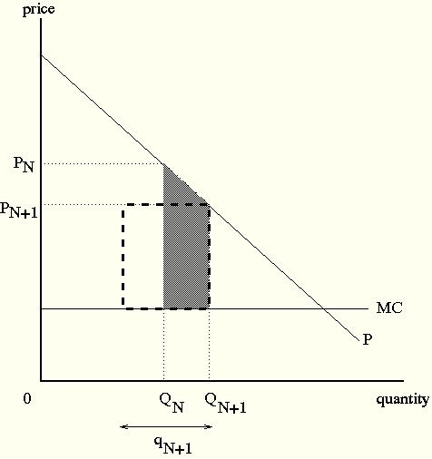

# Modelo de Mankiw e Whinston

O paper se baseia em três premissas que são bastante razoáveis:

* O Preço tem que ser maior que o Custo Marginal
* Existem Custos Fixos de Entrada
* Pelo menos parte dos consumidores que atendem a uma empresa nova vêm das outras empresas no mercado -- o "Efeito de Roubo de Clientes".

Vamos começar olhando para os bens homogêneos

### Bens Homogêneos

Seja $Q(N+1)-Q(N)$ a variação na quantidade total produzida pela indústria decorrente da entrada da N+1-ésima firma.Pelo terceiro bullet acima, temos que:

$$ Q(N+1)-Q(N)<q_{N+1} $$

Estamos supondo que $q_{N+1}$ é a quantidade produzida pela $N+1$-ésima empresa. Aqui já podemos notar qual seria o potencial problema:

* Benefícios sociais da entrada: $(P-CMg)\times (Q(N+1)-Q(N)) - F_{N+1}$, em que $F_{N+1}$ é o custo fixo de entrada da $N+1$ - ésima firma.
* Benefícios privados da entrada: $(P-CMg)\times q_{N+1} - F_{N+1}$. 

Graficamente:

Ou seja, há um incentivo para a entrada além da socialmente ótima, uma vez que parte dos consumidores já seriam atendidos. 

### Produtos Diferenciados

Com produtos diferenciados, a existência de variedade por si só é benéfica para o consumidor. Por um lado, mesmo pegando consumidores que já eram atendidos, existem ganhos para todos com a entrada de mais uma variedade.

Só que, por outro lado, esse benefício para os consumidores não é completamente capturado pelo entrante, então é possível que tenhamos MENOS entrada que o socialmente ótimo.

Vamos supor que tenhamos um consumidor representativo com função utilidade dada por:

$$ U=G(f(q_{1}), \cdots , f(q_{N})) $$

Sendo que $G(\cdot)$ e $f(\cdot)$ são côncavas e atendem as propriedades necessárias. Um exemplo seria a CES.

Os consumidores maximizam a utilidade igualando o preço com a utilidade marginal. Ou seja:

$$ p_{i}=G^{\prime} f^{\prime} (q_{i}) \forall i $$
Com uma função de custos da forma $CT_{i}=c(q_{i})+F$ e produtos entrando simetricamente na função utilidade, o bem-estar social (excedente do produtor e do consumidor) é dado por:

$$ W(N) = G(Nf(q_{N}))-Nc(q_{N})-NF $$

O que acontece com $W(N)$ quando $N$ aumenta?

$$\frac{\partial W}{\partial N} = G^{\prime} (f(q_{N}))+NG^{\prime}f^{\prime}\frac{\partial q_{N}}{\partial N} - c(q_{N}) - Nc^{\prime}\frac{\partial q_{N}}{\partial N} - F $$

Reorganizando as coisas, isso fica sendo:

$$ \frac{\partial W}{\partial N} = \left(G^{\prime} f^{\prime} q_{N} - c(q_{N}) -F \right) + \left(N(G^{\prime} f^{\prime} - c^{\prime})\frac{\partial q_{N}}{\partial N}  \right) + \left(G^{\prime}(f - f^{\prime} q_{N}) \right) $$

Esta equação precisa de interpretação. O primeiro parênteses é a diferença entre as receitas e os custos associados com a $N$-ésima entrada. Em um equilíbrio em livre entrada, este termo tem que ser igual a zero.

O segundo termo é a margem preço-custo marginal, multiplicada por $N$ e por uma derivada parcial que tem que ser negativa, pelo efeito "business stealing", ou seja $\frac{\partial q_{N}}{\partial N}<0$. Esse termo tem que ser negativo.

Finalmente, o terceiro termo representa o excedente do consumidor pela existência da $N$-ésima marca, independente do consumo dela. Esse termo é não-negativo (seria zero se estivéssemos no caso anterior).

O efeito final de termos uma marca a mais depende de qual dos efeitos é maior. Se o ganho com mais uma marca for maior do que o business-stealing effect, teríamos menos entrada que a socialmente ótimo (ou seja, uma situação em que o primeiro parênteses é zero e a derivada do bem-estar com relação ao número de marcas é ainda positiva).

Por outro lado, se o business stealing effect for maior do que o ganho de bem-estar com mais uma marca, teremos mais entrada que o socialmente ótimo.